# sa-fintech-skills

> Stop your AI assistant hallucinating South African payment integrations.

A curated, version-pinned skill pack for AI coding agents — Claude Code, Cursor, Copilot, Codex, and Gemini — covering Paystack, PayFast, POPIA, and SARS. One canonical source, five runtimes, MIT-licensed.

## Who this is for

- **Indie devs and startup engineers shipping payment flows in ZA** — Paystack, PayFast, Yoco. Your agent invents signature schemes; you fix them at 2am.
- **Compliance-aware teams handling SA personal information** — your DPO wants POPIA consent flags and DSAR endpoints; your agent doesn't know what those are.
- **Anyone integrating SARS eFiling, IRP5, VAT, or IT3(b)** — niche, badly-documented, training-data desert.

If you write code that touches `paystack.co`, `payfast.co.za`, an SA ID number, or a VAT calc — this pack is for you.

## The problem

AI training data is thin on SA fintech. Without help, agents:

- Write PayFast signature code that omits the URL-encode-before-MD5 step (silently fails ITN verification in production).
- Forget POPIA §11 consent capture, then your storage-of-PII handler ships a §11 violation.
- Default Paystack currency to USD instead of ZAR.
- Invent SARS field codes that don't exist.
- Suggest US-region storage for SA customer data with no §72 transborder safeguard.

The fix isn't "tell the agent more in the prompt" — it's a curated knowledge bundle the agent loads automatically when the work matches.

## What this pack does

Each skill is a single `SKILL.md` with triggers, runnable examples, and explicit "common mistakes" anti-patterns. The build step emits per-runtime artefacts so the same source ships to every supported agent:



Five emitters, one source of truth. Add a runtime, the rest stay in sync. Add a skill, every runtime gets it.

## Status

| | |
|---|---|
| Spec | approved 2026-06-07 |
| Phase | v0.1.0 — production ready, awaiting first npm publish |
| Skills | `paystack` (HMAC-SHA-512 webhook verify, ZAR init, splits) · `payfast` (form-post MD5 sig in documented order, ITN four-step validation) · `popia` (PII + consent + DSAR) · `sars-efiling` (15% VAT, IRP5 source codes, ITR12 fields) |
| Primitives | `validate-sa-id` (Luhn + DOB + citizenship) · `vat` (banker's rounding) · `bank-codes` (format validator + extensible PASA registry) |
| Distribution | `npx sa-fintech-skills install` CLI (`bin/cli.mjs`) · npm publish workflow with OIDC provenance · plugin marketplace auto-PR (guarded until Anthropic registry stable) |
| Audit | 0 vulnerabilities · 85 tests · CodeQL + Scorecard + nightly drift cron + branch protection |

Until the npm publish lands you can manually copy `dist/<runtime>/` (after `npm run build`) into your project for any of the 5 runtimes.

## Install (after v0.1.0 ships)

```
# Claude Code
/plugin install tzone85/sa-fintech-skills

# Cursor / Copilot / Codex / Gemini
npx sa-fintech-skills install
```

## Skills (v1)

| Skill | Triggers | What it teaches |
|---|---|---|
| `paystack` | "paystack", "init payment", "verify webhook", "split payment" | HMAC-SHA-512 webhook verify, init, subscriptions, splits, ZAR gotchas |
| `payfast` | "payfast", "ITN", "subscription token" | Form-post MD5 signature, ITN verify, sandbox/live URL switch, tokenisation |
| `popia` | "popia", "PII", "consent flag", "data residency", "DSAR" | Code audit for PII handling, consent capture, residency, DSAR endpoint template |
| `sars-efiling` | "sars", "VAT", "ITR12", "tax cert" | VAT 15% rounding, IRP5 codes, ITR12 field map, IT3(b) cert skeleton |

Each skill ships with a `## Common mistakes` block listing the failures we keep seeing in agent output — so the agent learns the boundary, not just the happy path.

## Why MIT

SA fintech docs are scattered, often inconsistent, and rarely make it into AI training data in any useful form. A permissively-licensed canonical reference removes that friction for the whole local dev community. If you ship something on top of it, contributing a skill or filing an issue is the way to pay it forward.

## Layout

```
skills/<name>/SKILL.md          canonical source
skills/<name>/examples/         runnable TS snippets
shared/za-primitives/           SA ID validate, VAT calc, bank codes
bin/cli.mjs                     npx entry point (dependency-free)
scripts/lib/                    parse-skill, token-budget, runtime-config
scripts/emitters/               one file per runtime
scripts/lint-skill.ts           CLI validator
scripts/build.ts                CLI orchestrator
scripts/smoke/                  per-skill smoke checks (fixtures + live)
dist/<runtime>/                 generated, gitignored
tests/golden/<runtime>/         emitter output snapshots (contracts)
docs/                           spec, plan, diagrams, Obsidian vault
```

## Operations

Three scheduled GitHub Actions keep the pack honest while the repo is quiet — a daily **nightly drift** run (fresh `npm ci`, dependency audit, full verify incl. live Paystack sandbox smoke when `PAYSTACK_TEST_SECRET_KEY` is set; failures auto-file a `drift`-labelled issue) plus weekly CodeQL and Scorecard. The full runbook, including what to do when drift fires, lives in the [Operations Runbook](docs/obsidian/Operations%20Runbook.md).

## Docs

| | |
|---|---|
| Design spec | [`docs/design.md`](docs/design.md) |
| Plan A (Foundation) | [`docs/plan-foundation.md`](docs/plan-foundation.md) |
| Diagrams | [`docs/diagrams/`](docs/diagrams/) — rendered SVG + mermaid sources |
| Obsidian vault | [`docs/obsidian/`](docs/obsidian/) — open as a vault, start at `Home.md`; overview, architecture, per-skill notes, ops runbook, launch checklist |
| Changelog | [`CHANGELOG.md`](CHANGELOG.md) |

## Security

This project ships content that AI agents apply to **payments and personal information** — the threat surface is wider than a typical npm utility. See [SECURITY.md](SECURITY.md) for the threat model, supported versions, and private vulnerability reporting path.

Current posture:

| Control | State |
|---|---|
| Private vulnerability reporting (GitHub PVR) | ✓ enabled |
| Secret scanning + push protection | ✓ enabled |
| Dependabot security updates | ✓ enabled (weekly grouped npm + actions PRs) |
| CodeQL — `security-and-quality` query suite | ✓ JS/TS + actions matrix, weekly + on PR |
| OSSF Scorecard | ✓ weekly + on `branch_protection_rule` |
| Branch protection on `main` | ✓ linear history, no force-push, no delete, code-owner review required, status check `verify` must pass |
| CI runner hardening | ✓ `permissions: {}` deny-all default, all actions pinned to commit SHAs, `persist-credentials: false`, harden-runner audit egress |
| `npm audit` | 0 vulnerabilities (was 6 before vitest 4 upgrade) |
| CODEOWNERS routing | `/skills/`, `/scripts/`, `/.github/`, LICENSE, SECURITY.md → @tzone85 |

Vulnerability reports → **https://github.com/tzone85/sa-fintech-skills/security/advisories/new**

## Contributing

Not accepting external code PRs yet (pre-v0.1.0). Issues welcome — especially: PayFast/SARS API behaviour you've hit in production, POPIA edge cases your team has lawyered, or a runtime we haven't covered. See [CONTRIBUTING.md](CONTRIBUTING.md).

## License

MIT — see [LICENSE](LICENSE).
